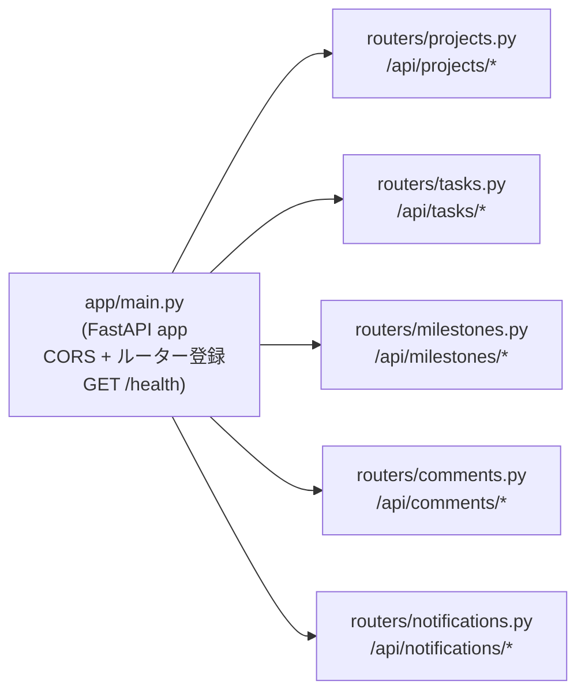

# API 設計

## 責務

FastAPI が提供する REST API のエンドポイント・リクエスト/レスポンス設計の概要を記述する。

**機械可読スキーマ（真実源）**: `GET /openapi.json`（FastAPI 自動生成）。フロントエンド型定義（`src/types/api.d.ts`）は `/openapi-sync` スキルで同期する。本ドキュメントはエンドポイント一覧と構成の概要のみを保持し、詳細なリクエスト/レスポンス仕様は `/openapi.json` を参照する。

## 構成要素

### ルーター構成

### エンドポイント一覧

| メソッド | パス | 説明 |
|--------|------|------|
| GET | `/health` | ヘルスチェック |
| GET | `/api/projects` | プロジェクト一覧 |
| POST | `/api/projects` | プロジェクト作成 |
| GET | `/api/projects/{id}` | プロジェクト詳細 |
| PUT | `/api/projects/{id}` | プロジェクト更新 |
| DELETE | `/api/projects/{id}` | プロジェクト削除（論理） |
| GET | `/api/projects/{id}/tasks` | タスク一覧（階層付き） |
| POST | `/api/projects/{id}/tasks` | タスク作成 |
| GET | `/api/tasks/{id}` | タスク詳細 |
| PUT | `/api/tasks/{id}` | タスク更新（進捗・ステータス等） |
| DELETE | `/api/tasks/{id}` | タスク削除（論理） |
| POST | `/api/tasks/{id}/reorder` | タスク並び替え（sort_order 更新） |
| GET | `/api/projects/{id}/milestones` | マイルストーン一覧 |
| POST | `/api/projects/{id}/milestones` | マイルストーン作成 |
| GET | `/api/milestones/{id}` | マイルストーン詳細 |
| PUT | `/api/milestones/{id}` | マイルストーン更新 |
| DELETE | `/api/milestones/{id}` | マイルストーン削除（論理） |
| GET | `/api/tasks/{id}/comments` | コメント一覧 |
| POST | `/api/tasks/{id}/comments` | コメント投稿 |
| PUT | `/api/comments/{id}` | コメント更新 |
| DELETE | `/api/comments/{id}` | コメント削除（論理） |
| GET | `/api/notifications` | 通知一覧 |
| PUT | `/api/notifications/{id}/read` | 既読更新（1 件） |
| PUT | `/api/notifications/read-all` | 全既読 |

## 外部依存・インターフェース

- Pydantic スキーマ（`app/schemas/`）がリクエスト/レスポンスの型を定義
- SQLAlchemy モデル（`app/models/`）がデータアクセスを担当

## 主要な設計判断

- **リソース中心の REST 設計**: タスクはプロジェクト配下（`/projects/{id}/tasks`）で作成し、個別操作は `/tasks/{id}` で行う（プロジェクトIDの再指定不要）。
- **DELETE は 204 No Content**: 論理削除のため DB には残るが、クライアントには削除完了として返す。
- **ページネーション**: 初期リリースはシンプルにオフセットベース（`?skip=0&limit=100`）。大規模データが想定されない社内ツールのため。
- **通知はサーバープッシュしない**: WebSocket・SSE は初期スコープ外。ポーリング（画面描画時に GET /api/notifications）で対応。
