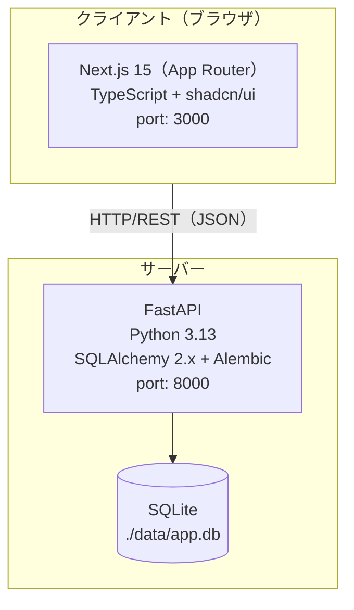
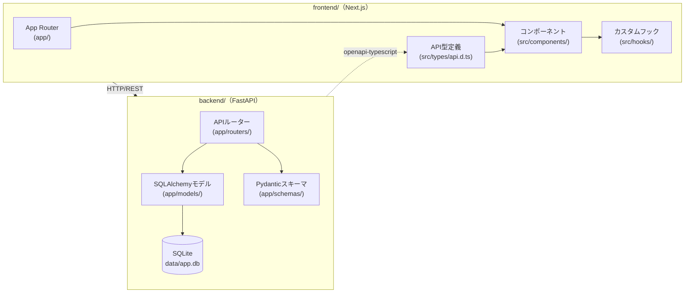
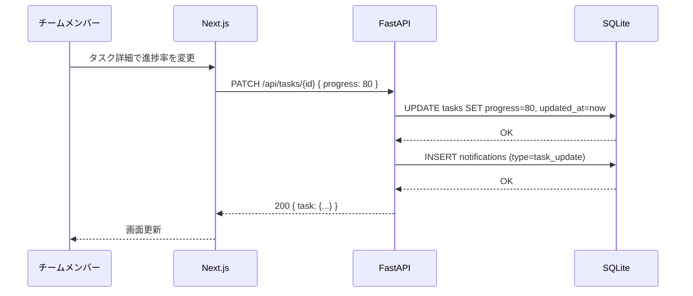
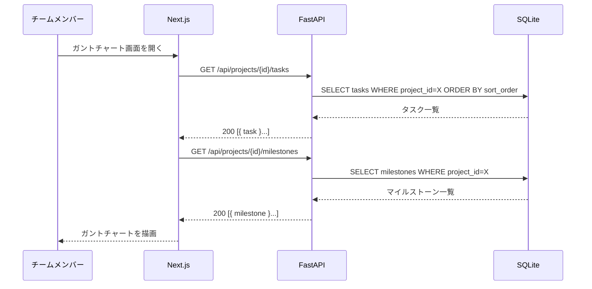

# アーキテクチャ設計

## 責務

システム全体の構成・コンポーネント間の関係・デプロイ構成・非機能設計を記述する。他の設計領域の照合元となる。

## 構成要素

### システム概観

### コンポーネント構成

## データフロー・主要シーケンス

### タスク進捗更新

### ガントチャート表示

## 外部依存・インターフェース

| 依存 | バージョン | 役割 |
|------|---------|------|
| Next.js | 15 | フロントエンドフレームワーク（App Router） |
| TypeScript | 5.x | フロント言語 |
| shadcn/ui | 最新 | UI コンポーネントライブラリ（Radix UI ベース） |
| Tailwind CSS | v4 | CSS フレームワーク |
| FastAPI | 最新安定版 | バックエンド API フレームワーク |
| Python | 3.13 | バックエンド言語 |
| SQLAlchemy | 2.x | Python ORM |
| Alembic | 最新安定版 | DB マイグレーション管理 |
| SQLite | 3.x | データベース（`./data/app.db`） |

**API スキーマ**: FastAPI が `GET /openapi.json` を自動生成。フロントエンドの型定義（`src/types/api.d.ts`）は `/openapi-sync` スキルで同期する（手書き型定義との二重管理を避ける）。

## 非機能設計

### パフォーマンス目標

| 指標 | 目標値 | 計測条件 |
|------|-------|---------|
| 画面初期ロード | 3 秒以内 | 1,000 タスクのプロジェクト |
| 一般操作（保存・更新） | 1 秒以内 | 通常操作 |
| ガントチャート描画 | 2 秒以内 | 100 タスク以上 |
| 同時接続 | 10 人未満 | SQLite の書き込みロック考慮 |

### セキュリティ境界

- 認証なし（社内ネットワーク/VPN でアクセス制御）
- CORS: フロントエンドオリジンのみ許可（`localhost:3000` / 本番 URL）
- 入力バリデーション: フロント（React Hook Form + Zod）・バック（Pydantic）の二層

### 可用性・監視

- ヘルスチェック: `GET /health`（FastAPI 実装済み）
- ログ: FastAPI 標準ログ（標準出力、エラーレベル以上）
- バックアップ: SQLite ファイルの定期バックアップ（デプロイ先確定後に設計）

## 主要な設計判断

- **SQLite 採用**: 10 人未満の小規模社内ツールのため。サーバー不要・運用コスト最小。同時書き込みが問題になる規模になれば PostgreSQL へ移行検討。
- **認証なし**: 社内ネットワーク（VPN/LAN）でアクセス制御するため、アプリレベル認証を省略。担当者名はフリーテキスト入力。
- **OpenAPI スキーマ駆動**: FastAPI の `/openapi.json` を真実源とし、`openapi-typescript` でフロント型定義を自動生成。型の手書き二重管理を避ける。
- **Next.js App Router + FastAPI の分離**: フロント（SSR/RSC）とバック（REST API）を明確に分離し、バックを将来的に独立デプロイ可能な状態を保つ。
