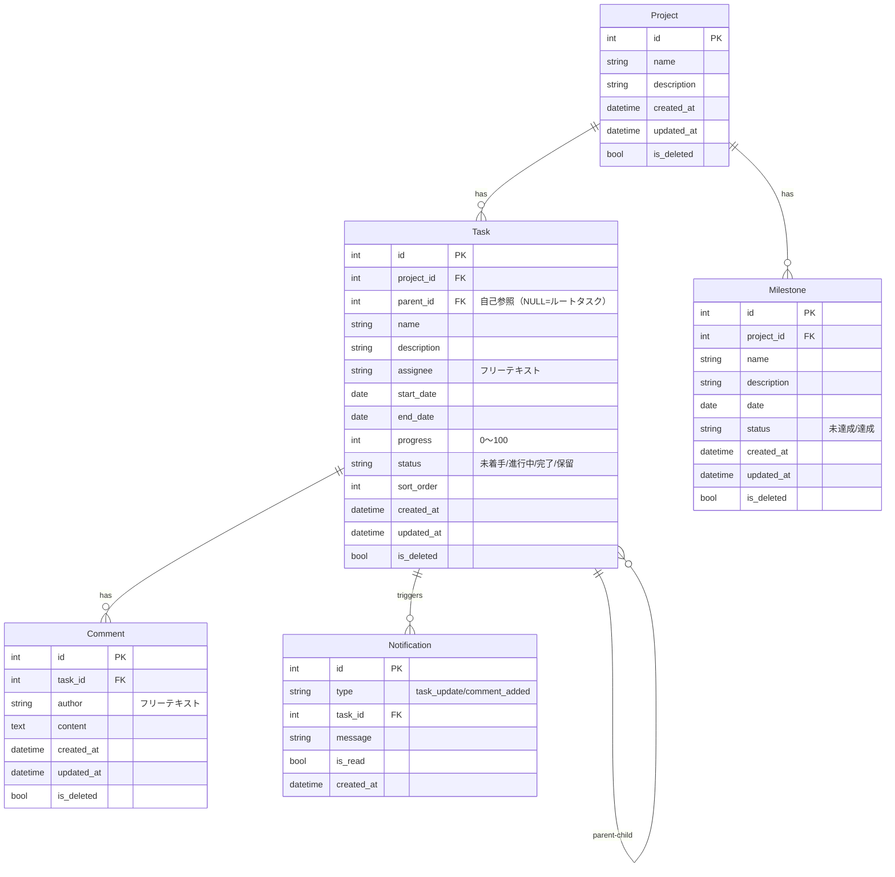

# データモデル設計

## 責務

SQLite データベースのエンティティ・関係・制約・インデックスを定義する。

## 構成要素

### ER 図

## データフロー・主要シーケンス

タスク作成 → 通知生成のフロー: `POST /api/projects/{id}/tasks` → INSERT tasks → INSERT notifications。

## 外部依存・インターフェース

- SQLAlchemy 2.x のモデルクラス（`app/models/`）がこの ER 図の Python 表現
- Alembic マイグレーションが DDL を管理（`backend/alembic/versions/`）

## 横断的関心事

- **日時カラム**: `DATETIME DEFAULT (datetime('now'))` で UTC 保存。フロントで JST 変換して表示（`.claude/rules/` 横断設計参照 → `docs/design/cross-cutting.md`）
- **インデックス**: `tasks.project_id`・`tasks.parent_id`・`notifications.task_id` に追加（クエリ頻度が高いため）

## 主要な設計判断

- **論理削除（is_deleted）**: 削除操作は `is_deleted=True` のみ。物理削除は明示的な管理操作のみ。誤削除からの復旧が可能。
- **担当者フリーテキスト（assignee）**: 認証・ユーザーテーブルを持たないため。将来ユーザー管理を導入する場合は外部キーに移行。
- **sort_order カラム**: D&D によるタスク並び替えを永続化するための整数カラム。再番号付け（renumber）は並び替え時に実行。
- **自己参照 parent_id**: 無制限ネストの WBS 階層を 1 テーブルで表現（閉包テーブルより実装が簡単。深さが极端に大きくなる想定はない）。
- **Notification はカスケード削除しない**: タスクを論理削除しても通知は残す（既読管理に影響するため）。
