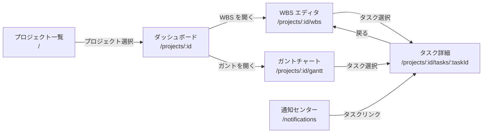
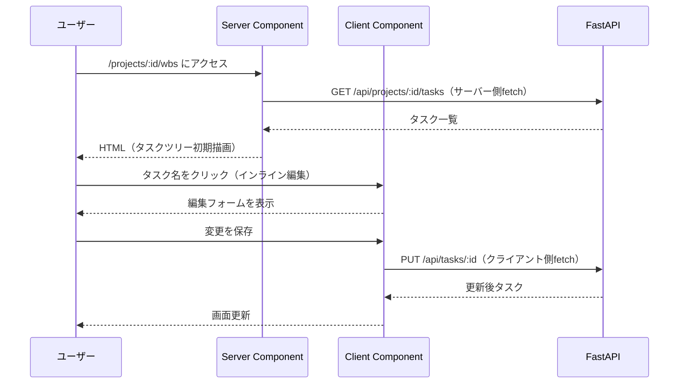
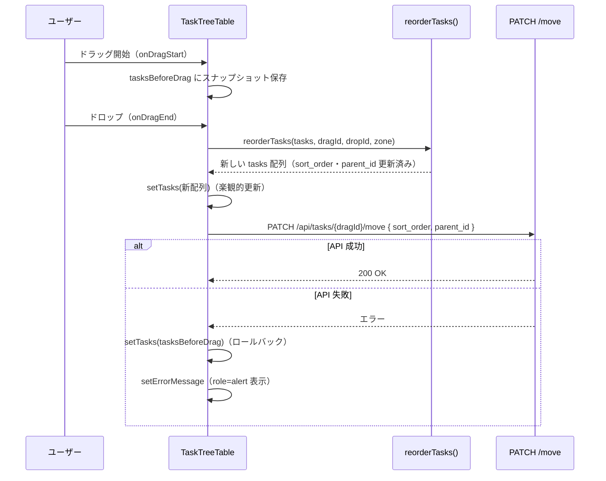

# UI/画面設計

## 責務

フロントエンドの画面構成・コンポーネント分割・状態設計・デザインシステムを定義する。

## 構成要素

### 画面一覧と遷移



### 主要コンポーネント分割（案）

| コンポーネント | 責務 | 状態種別 |
|------------|------|---------|
| `ProjectCard` | プロジェクト一覧の 1 件カード | idle / hover |
| `ProjectList` | プロジェクト一覧・検索フィルタ | loading / empty / populated |
| `TaskTreeTable` | WBS ツリーテーブル（階層表示・D&D） | loading / empty / populated |
| `TaskRow` | ツリーテーブルの 1 行（インライン編集） | view / editing |
| `GanttChart` | ガントチャート本体 | loading / empty / populated |
| `GanttBar` | タスクのガントバー（D&D で期間変更） | idle / dragging |
| `MilestoneMarker` | ガントのダイヤモンドマーカー | achieved / pending |
| `TaskDetailPanel` | タスク詳細パネル | loading / viewing / editing |
| `CommentThread` | コメント一覧・投稿フォーム | loading / empty / populated / submitting |
| `NotificationBadge` | ヘッダーの通知アイコン（未読数） | unread / empty |
| `NotificationList` | 通知センター一覧 | loading / empty / populated |

## データフロー・主要シーケンス



## 状態設計（主要画面）

| 画面 | ローディング | 空 | 通常 | エラー |
|------|-----------|----|----- |-------|
| プロジェクト一覧 | スケルトン（カード） | 「プロジェクトを作成」CTA | カード一覧 | `role="alert"` |
| WBS エディタ | スケルトン（テーブル行） | 「タスクを追加」CTA | ツリーテーブル | `role="alert"` |
| ガントチャート | スケルトン（バー） | 「タスクを追加」CTA | タイムライン | `role="alert"` |
| タスク詳細 | スケルトン（フォーム） | — | 属性フォーム | `role="alert"` |
| 通知センター | スケルトン（リスト行） | 「通知はありません」 | 通知リスト | `role="alert"` |

## 外部依存・インターフェース

- shadcn/ui（`src/components/ui/`）: Button, Input, Select, Dialog, Tooltip 等
- Tailwind CSS v4: ユーティリティクラス
- Storybook 10（`npm run storybook`）: コンポーネントカタログ

**ガントチャートライブラリ**: TBD（dhtmlx-gantt または独自実装。[未決事項 - docs/要件定義書.md](../要件定義書.md#9-未決事項)）

## デザイントークン参照

shadcn/ui のデフォルト CSS 変数テーマを使用（`frontend/src/app/globals.css`）:

| トークン | 用途 |
|---------|------|
| `--background` / `--foreground` | ベース背景・テキスト（ニュートラルグレー） |
| `--primary` / `--primary-foreground` | 主要アクションボタン（青系） |
| `--destructive` | 削除・エラー（赤系） |
| `--muted` | 非活性テキスト・プレースホルダー |
| `--border` | 区切り線・カード境界 |

カスタムトークンが必要な場合は `frontend/src/app/globals.css` の `:root` に追記する。

## レスポンシブ方針

デスクトップ優先（1280×720 以上）。モバイル最適化はスコープ外。
主要ブレークポイント: `lg`（1024px）を基準にサイドバーの表示/非表示を切り替える。

## アクセシビリティ

- **キーボード操作**: WBS ツリーは矢印キーで展開/折りたたみ対応。インライン編集は Enter で確定・Esc でキャンセル
- **コントラスト**: WCAG AA（4.5:1 以上）を維持（shadcn/ui デフォルトが対応済み）
- **フォーム**: `aria-label` または関連 `<label>` を必ず付与
- **エラー通知**: `role="alert"` でスクリーンリーダーに通知
- **ローディング**: `aria-busy="true"` を付与

## コンポーネントカタログ

Storybook（`npm run storybook`、port 6006）で状態別カタログを管理する。新コンポーネントを追加したら `stories/<Component>.stories.ts` を同時に作成する（状態別: idle / loading / empty / error 等）。

## スクリーンショット

| 画面 | 日付 | ファイル |
|------|------|--------|
| プロジェクト一覧（デスクトップ 1280px） | 2026-06-14 | [12-project-list-desktop-after.png](../screenshots/12-project-list-desktop-after.png) |
| プロジェクト一覧（モバイル 375px） | 2026-06-14 | [12-project-list-mobile-after.png](../screenshots/12-project-list-mobile-after.png) |
| WBS エディタ（デスクトップ 1440px） | 2026-06-14 | [15-wbs-desktop-after.png](../screenshots/15-wbs-desktop-after.png) |
| WBS エディタ（モバイル 375px） | 2026-06-14 | [15-wbs-mobile-after.png](../screenshots/15-wbs-mobile-after.png) |

UI 変更時は `frontend-reviewer` でスクリーンショットを取得し `docs/screenshots/` に保存して本表を更新する。

## プロジェクト一覧・作成画面（Issue #12）

### 画面構成・ワイヤーフレーム

```
┌─────────────────────────────────────────────────────┐
│ プロジェクト一覧                       [+ 新規プロジェクト] │
│ [🔍 プロジェクトを検索...]                               │
├─────────────────────────────────────────────────────┤
│ ┌──────────────────┐  ┌──────────────────┐          │
│ │ プロジェクトA        │  │ プロジェクトB        │          │
│ │ 説明テキスト（任意）  │  │ 説明テキスト（任意）  │          │
│ └──────────────────┘  └──────────────────┘          │
│                                                     │
│ ┌─────────────────────────────────────────────┐     │
│ │   プロジェクトがありません                          │     │
│ │   [最初のプロジェクトを作成する]                     │     │
│ └─────────────────────────────────────────────┘     │
└─────────────────────────────────────────────────────┘
```

**モーダル（新規プロジェクト作成）:**
```
┌────────────────────────────────────┐
│ 新規プロジェクト作成             [×] │
├────────────────────────────────────┤
│ プロジェクト名 *                     │
│ [入力欄（最大100文字）           ]   │
│ ※ バリデーションエラー: role=alert   │
│                                    │
│ 説明（任意）                          │
│ [テキストエリア                  ]   │
│                                    │
│         [キャンセル]  [作成]          │
└────────────────────────────────────┘
```

### コンポーネント分割

| コンポーネント | 種別 | 責務 |
|------------|------|------|
| `app/page.tsx` | Server Component | プロジェクト一覧の初期データフェッチ（`GET /api/projects`） |
| `app/loading.tsx` | Server Component | ローディング中のスケルトン（カード3件分、Next.js App Router） |
| `app/error.tsx` | Client Component | API エラー時の `role="alert"` バナー + 再試行ボタン |
| `components/layout/PageShell.tsx` | Server Component | ページ共通レイアウト（`min-h-screen`・最大幅コンテナ） |
| `components/project/ProjectList.tsx` | Client Component (`"use client"`) | 検索フィルタ状態管理・カード一覧表示・モーダル開閉 |
| `components/project/ProjectCard.tsx` | Server Component | 1件分のカード表示（名前・説明） |
| `components/project/CreateProjectModal.tsx` | Client Component | 新規作成モーダル（shadcn/ui `<Dialog>`）・`<form>` バリデーション |
| `components/project/layout.ts` | — | カードグリッドの CSS クラス定数（`PROJECT_GRID_CLASS`） |

### 状態設計

| 状態 | 表示内容 | 実装 |
|------|---------|------|
| ローディング | スケルトン（カード3件分） | `loading.tsx`（Next.js App Router） |
| 空 | 「プロジェクトがありません」 + CTA ボタン | `projects.length === 0` の分岐 |
| 通常 | カードグリッド（2〜3列） | `grid-cols-1 sm:grid-cols-2 lg:grid-cols-3` |
| エラー | `role="alert"` バナー + 再試行ボタン | `error.tsx`（Next.js App Router） |
| モーダル | 作成フォーム | `useState` で `open` 管理 |
| バリデーションエラー | `role="alert"` のエラーメッセージ | `useState` による直接管理 |

### レスポンシブ

- `grid-cols-1`（375px〜）→ `sm:grid-cols-2`（640px〜）→ `lg:grid-cols-3`（1024px〜）
- 375px では1列に折りたたみ、横スクロールなし（最低限対応：モバイル最適化は対象外）

### 使用する shadcn/ui コンポーネント

追加インストールが必要: `Dialog`, `Input`, `Textarea`, `Label`, `Skeleton`

```bash
cd frontend && npx shadcn add dialog input textarea label skeleton
```

## WBS エディタ（Issue #14）

### 画面構成・ワイヤーフレーム

```
┌─────────────────────────────────────────────────────────┐
│ WBS エディタ                        [全展開] [全折りたたみ] │
│                                              [+ タスク追加] │
├──────┬────────────────────────────┬──────────┬──────────┤
│ 展開  │ タスク名                    │ ステータス │  削除     │
├──────┼────────────────────────────┼──────────┼──────────┤
│  ▼   │ タスク A                    │  未着手   │  [🗑]   │
│      │   ▼ 子タスク A1             │  進行中   │  [🗑]   │
│      │     └ 孫タスク A1-1         │  完了     │  [🗑]   │
│  ▶   │ タスク B（折りたたみ）         │  未着手   │  [🗑]   │
├──────┴────────────────────────────┴──────────┴──────────┤
│ ※ 空状態：                                                │
│  ┌───────────────────────────────────────────────────┐  │
│  │  タスクがありません。[+ 最初のタスクを追加する]          │  │
│  └───────────────────────────────────────────────────┘  │
└─────────────────────────────────────────────────────────┘
```

**インライン編集（タスク名クリック時）:**
```
│  ▼   │ [____________編集中__________] │  未着手   │  [🗑]   │
│      │  ↳ Enter で確定 / Esc でキャンセル                   │
```

**Enter で新規行追加（現在フォーカス行の直下）:**
```
│  ▼   │ タスク A                        │  未着手   │  [🗑]   │
│      │   [__新しいタスク名を入力中______] │           │  [🗑]   │  ← 追加
│      │   ▼ 子タスク A1                 │  進行中   │  [🗑]   │
```

### コンポーネント分割

| コンポーネント | 種別 | 責務 |
|------------|------|------|
| `app/projects/[id]/wbs/page.tsx` | Server Component | タスク一覧の初期データ取得（`GET /api/projects/:id/tasks`）＋ ProjectCard へのリンク用プロジェクト名取得 |
| `app/projects/[id]/wbs/loading.tsx` | — | スケルトン（テーブル行3件分） |
| `app/projects/[id]/wbs/error.tsx` | Client Component | API エラー時の `role="alert"` バナー＋再試行 |
| `components/wbs/TaskTreeTable.tsx` | Client Component | WBS テーブル本体（ツリー変換・展開/折りたたみ・タスク追加/削除）|
| `components/wbs/TaskRow.tsx` | Client Component | 1行（インライン編集・削除ボタン・展開アイコン）|
| `lib/taskTree.ts` | — | `buildTree()` / `flattenVisible()` ユーティリティ関数 |
| `types/task.ts` | — | `Task` 型定義（バックエンド `TaskResponse` に対応） |

`ProjectCard` に「開く」ボタン（`/projects/[id]/wbs`）を追加。

### 状態設計

```typescript
// TaskTreeTable.tsx 内
const [tasks, setTasks] = useState<Task[]>(initialTasks)
const [editingId, setEditingId] = useState<number | null>(null)
const [collapsedIds, setCollapsedIds] = useState<Set<number>>(new Set())
```

| 状態 | 表示内容 |
|------|---------|
| ローディング | スケルトン（テーブル行3件分） |
| 空（tasks.length === 0） | 「タスクがありません」＋CTA ボタン |
| 通常 | ツリーテーブル |
| エラー | `role="alert"` バナー＋再試行 |
| タスク名クリック | インライン編集モード（`editingId` が該当行） |
| 子タスクを持つ行の展開アイコンクリック | `collapsedIds` トグル |

### ツリー変換

バックエンドはフラットリスト（`parent_id` 参照）を返す。フロントで `buildTree()` によりツリー構造に変換し、`flattenVisible()` で折りたたみ状態を考慮した表示行リストを生成する。

```
buildTree(tasks: Task[]): TreeNode[]
  → parent_id で親子を結合
  → sort_order で並び順を保持

flattenVisible(nodes: TreeNode[], collapsedIds: Set<number>): FlatRow[]
  → depth（インデント量）を各行に付与
  → collapsedIds に含まれる node の children はスキップ
```

### API 対応

| 操作 | API |
|------|-----|
| タスク一覧取得 | `GET /api/projects/{id}/tasks` |
| タスク追加 | `POST /api/projects/{id}/tasks`（`parent_id` 指定でネスト、`sort_order` 自動計算） |
| タスク名更新 | `PATCH /api/tasks/{id}`（`{ name }` のみ送信） |
| タスク削除 | `DELETE /api/tasks/{id}`（子タスクも連鎖論理削除） |

### レスポンシブ

375px 幅では横スクロール可（テーブル形式のため最低幅を確保しつつ、`overflow-x-auto` でスクロール対応）。

### アクセシビリティ

- 展開/折りたたみアイコンに `aria-expanded` / `aria-label` を付与
- インライン編集インプットに `aria-label="タスク名を編集"` を付与
- 削除ボタンに `aria-label="タスクを削除: {タスク名}"` を付与

## 主要な設計判断

- **shadcn/ui 採用**: カスタマイズ性の高い既製 UI コンポーネントを流用し、デザイン実装コストを最小化。`components/ui/` は自動生成のため直接編集しない。
- **RSC（Server Components）でのデータフェッチ**: 初期描画はサーバーコンポーネントで行い、ハイドレーション量を最小化。インタラクティブな部分（D&D・インライン編集）のみ `"use client"` で切り出す。
- **デスクトップ優先**: 全機能を 1280px 以上で最適化。モバイル/タブレットは対象外（要件で明示的にスコープ外）。
- **楽観的更新を採用しない（D&D を除く）**: 実装シンプルさ優先。保存完了後にサーバーレスポンスで画面を更新する。D&D 並び替えのみ例外（操作感のため楽観的更新＋失敗時ロールバック方式を採用、Issue #15）。
- **Issue #12: カードグリッドレイアウト採用**: Linear/Notion に近いビジュアルでプロジェクトを把握しやすい。情報密度よりも一目でわかる視覚的なカード形式を優先。
- **Issue #12: クライアント側検索**: 検索ごとにAPIを呼ばず `Array.filter()` で処理。プロジェクト数が少ない（10人以下チーム）前提のため、パフォーマンス上問題なし。
- **Issue #12: 375px 最低限対応**: 要件定義書でモバイル最適化は対象外だが、横スクロールが出ない程度の最低限対応（1列グリッドに折りたたむ）を実施する（Issue AC#6 の要件と整合）。
- **Issue #14: テーブル形式 WBS 採用**: 展開列・タスク名列・ステータス列・削除列の4列構成。将来の列追加（担当者・期日・進捗）に対応しやすい。
- **Issue #14: ProjectCard → /projects/[id]/wbs 直接リンク**: ダッシュボードページ（`/projects/[id]`）は将来の Issue で追加。Issue #14 のスコープを WBS エディタ本体に絞る。
- **Issue #14: buildTree / flattenVisible 分離**: ツリー変換ロジックをコンポーネントから分離して `lib/taskTree.ts` に置く（単体テスト対象）。
- **Issue #14: Enter で現在フォーカス行直下に追加**: Notion/Linear スタイルの操作感。`parent_id` は追加元タスクと同じ親を引き継ぐ（兄弟として追加）。
- **Issue #15: ドロップゾーン方式（案A）採用**: 行の上半分＝「前に兄弟挿入」ゾーン、下半分＝「後に兄弟挿入」ゾーン、下部インデント部分＝「子にする」ゾーンの3分割で判定。水平オフセット方式（案B）より実装が明確で UX も直感的。
- **Issue #15: PATCH /api/tasks/{id}/move 新エンドポイント**: sort_order + parent_id を1回で更新。既存 /sort エンドポイント（sort_order のみ）を汚染しない。
- **Issue #15: 楽観的更新採用**: ドロップ直後に UI を即時更新しロールバックは API 失敗時のみ（D&D の操作感を損なわないため。既存の「楽観的更新を採用しない」方針の例外）。

## WBS ドラッグ＆ドロップ（Issue #15）

### 画面構成・ワイヤーフレーム

```
ドラッグ中のイメージ:
┌─────────────────────────────────────────────┐
│ ≡  タスク A              [ドラッグ中・半透明]  │  ← ドラッグ元（ghostとして残る）
├─────────────────────────────────────────────┤
│  ↑ ここに挿入（兄弟・前）─────────────────── │  ← ハイライト線（前ゾーン）
│ ≡  タスク B                             🗑  │
│     └─ ここに↴（子にする）──────────────── │  ← インデント付きハイライト線（子ゾーン）
│  ↓ ここに挿入（兄弟・後）─────────────────  │  ← ハイライト線（後ゾーン）
└─────────────────────────────────────────────┘

各ゾーンの判定（ホバー位置のY座標比率）:
  0% ─── 33%  → 「前に兄弟挿入」（parent_id = ドロップ先の親と同じ）
  34% ── 66%  → 「後に兄弟挿入」（parent_id = ドロップ先の親と同じ）
  67% ── 100% → 「子にする」（parent_id = ドロップ先のタスクID）
```

### コンポーネント分割

| コンポーネント | 種別 | 責務 |
|------------|------|------|
| `components/wbs/TaskTreeTable.tsx` | Client Component | D&D コンテキスト（`DndContext`）・`DraggableTaskRow`・`DropZone`（ファイル内定義）・ドロップゾーン判定・API 呼び出し・ロールバック管理を含む |
| `DraggableTaskRow`（`TaskTreeTable.tsx` 内） | — | `useDraggable` を持つ1行コンポーネント（ドラッグハンドル・DropZone 配置） |
| `DropZone`（`TaskTreeTable.tsx` 内） | — | `useDroppable` を持つドロップ受け皿。ドラッグ非活性時は `pointer-events-none` で通常操作を阻害しない |
| `lib/taskTree.ts` | — | `reorderTasks()` を追加: ドロップ結果から新しいタスク配列（sort_order・parent_id 更新済み）を計算 |

### 状態設計（追加分）

```typescript
// TaskTreeTable.tsx に追加するステート
const [draggingId, setDraggingId] = useState<number | null>(null)
const [tasksBeforeDrag, setTasksBeforeDrag] = useState<Task[]>([])  // ロールバック用スナップショット
```

### D&D フロー



### API 変更（バックエンド）

- **新スキーマ** `TaskMoveUpdate`: `{ sort_order: int, parent_id: int | None }`
- **新エンドポイント** `PATCH /api/tasks/{task_id}/move`: sort_order と parent_id を一括更新

### アクセシビリティ（D&D 追加分）

- ドラッグハンドルに `aria-label="ドラッグして並べ替え"` を付与
- ドラッグ中は `aria-grabbed` 属性を管理（@dnd-kit がデフォルトで対応）
- キーボードドラッグ対応（`KeyboardSensor`）: Space で掴み・矢印キーで移動・Space で離す
- 注: `aria-dropeffect` は ARIA 1.1 以降 deprecated のため使用しない（@dnd-kit の内部 ARIA 管理に委ねる）
