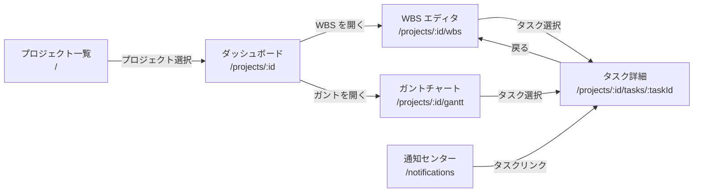
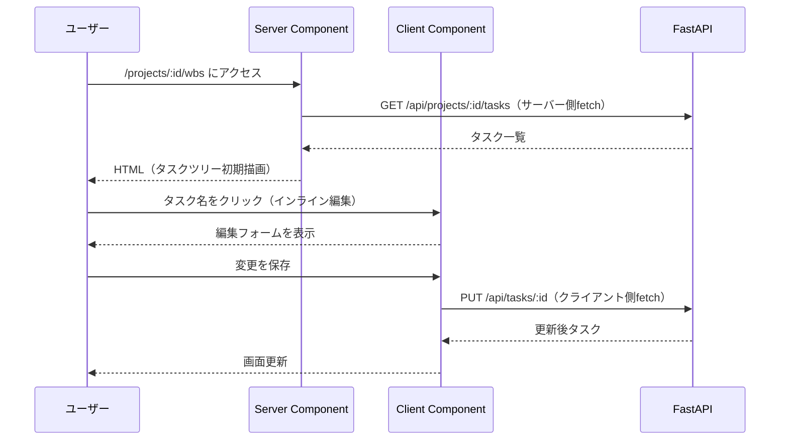

# UI/画面設計

## 責務

フロントエンドの画面構成・コンポーネント分割・状態設計・デザインシステムを定義する。

## 構成要素

### 画面一覧と遷移

### 主要コンポーネント分割（案）

| コンポーネント | 責務 | 状態種別 |
|------------|------|---------|
| `ProjectCard` | プロジェクト一覧の 1 件カード | idle / hover |
| `ProjectList` | プロジェクト一覧・検索フィルタ | loading / empty / populated |
| `TaskTreeTable` | WBS ツリーテーブル（階層表示・D&D） | loading / empty / populated |
| `TaskRow` | ツリーテーブルの 1 行（インライン編集） | view / editing |
| `GanttChart` | ガントチャート本体 | loading / empty / populated |
| `GanttBar` | タスクのガントバー（D&D で期間変更） | idle / dragging |
| `MilestoneMarker` | ガントのダイヤモンドマーカー | achieved / pending |
| `TaskDetailPanel` | タスク詳細パネル | loading / viewing / editing |
| `CommentThread` | コメント一覧・投稿フォーム | loading / empty / populated / submitting |
| `NotificationBadge` | ヘッダーの通知アイコン（未読数） | unread / empty |
| `NotificationList` | 通知センター一覧 | loading / empty / populated |

## データフロー・主要シーケンス

## 状態設計（主要画面）

| 画面 | ローディング | 空 | 通常 | エラー |
|------|-----------|----|----- |-------|
| プロジェクト一覧 | スケルトン（カード） | 「プロジェクトを作成」CTA | カード一覧 | `role="alert"` |
| WBS エディタ | スケルトン（テーブル行） | 「タスクを追加」CTA | ツリーテーブル | `role="alert"` |
| ガントチャート | スケルトン（バー） | 「タスクを追加」CTA | タイムライン | `role="alert"` |
| タスク詳細 | スケルトン（フォーム） | — | 属性フォーム | `role="alert"` |
| 通知センター | スケルトン（リスト行） | 「通知はありません」 | 通知リスト | `role="alert"` |

## 外部依存・インターフェース

- shadcn/ui（`src/components/ui/`）: Button, Input, Select, Dialog, Tooltip 等
- Tailwind CSS v4: ユーティリティクラス
- Storybook 10（`npm run storybook`）: コンポーネントカタログ

**ガントチャートライブラリ**: TBD（dhtmlx-gantt または独自実装。[未決事項 - docs/要件定義書.md](../要件定義書.md#9-未決事項)）

## デザイントークン参照

shadcn/ui のデフォルト CSS 変数テーマを使用（`frontend/src/app/globals.css`）:

| トークン | 用途 |
|---------|------|
| `--background` / `--foreground` | ベース背景・テキスト（ニュートラルグレー） |
| `--primary` / `--primary-foreground` | 主要アクションボタン（青系） |
| `--destructive` | 削除・エラー（赤系） |
| `--muted` | 非活性テキスト・プレースホルダー |
| `--border` | 区切り線・カード境界 |

カスタムトークンが必要な場合は `frontend/src/app/globals.css` の `:root` に追記する。

## レスポンシブ方針

デスクトップ優先（1280×720 以上）。モバイル最適化はスコープ外。
主要ブレークポイント: `lg`（1024px）を基準にサイドバーの表示/非表示を切り替える。

## アクセシビリティ

- **キーボード操作**: WBS ツリーは矢印キーで展開/折りたたみ対応。インライン編集は Enter で確定・Esc でキャンセル
- **コントラスト**: WCAG AA（4.5:1 以上）を維持（shadcn/ui デフォルトが対応済み）
- **フォーム**: `aria-label` または関連 `<label>` を必ず付与
- **エラー通知**: `role="alert"` でスクリーンリーダーに通知
- **ローディング**: `aria-busy="true"` を付与

## コンポーネントカタログ

Storybook（`npm run storybook`、port 6006）で状態別カタログを管理する。新コンポーネントを追加したら `stories/<Component>.stories.ts` を同時に作成する（状態別: idle / loading / empty / error 等）。

## スクリーンショット

| 画面 | 日付 | ファイル |
|------|------|--------|
| ベースライン（デスクトップ） | 2026-06-14 | [baseline-desktop.png](../screenshots/baseline-desktop.png) |
| ベースライン（モバイル参考） | 2026-06-14 | [baseline-mobile.png](../screenshots/baseline-mobile.png) |

UI 変更時は `frontend-reviewer` でスクリーンショットを取得し `docs/screenshots/` に保存して本表を更新する。

## 主要な設計判断

- **shadcn/ui 採用**: カスタマイズ性の高い既製 UI コンポーネントを流用し、デザイン実装コストを最小化。`components/ui/` は自動生成のため直接編集しない。
- **RSC（Server Components）でのデータフェッチ**: 初期描画はサーバーコンポーネントで行い、ハイドレーション量を最小化。インタラクティブな部分（D&D・インライン編集）のみ `"use client"` で切り出す。
- **デスクトップ優先**: 全機能を 1280px 以上で最適化。モバイル/タブレットは対象外（要件で明示的にスコープ外）。
- **楽観的更新を採用しない**: 実装シンプルさ優先。保存完了後にサーバーレスポンスで画面を更新する。
