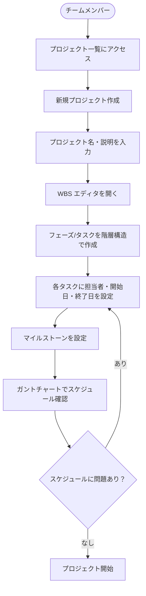
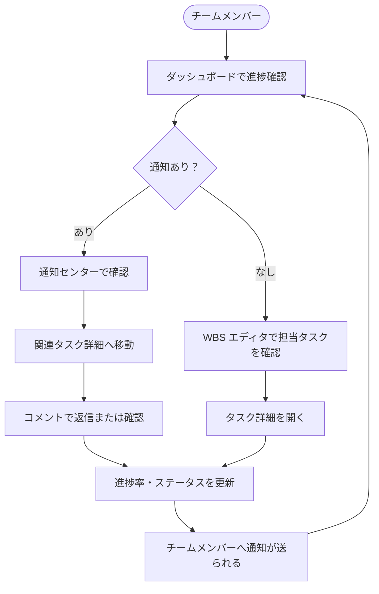

# 要件定義書

> **プロジェクト名**: WBS・マイルストーン管理ツール（仮称）
> **作成日**: 2026-06-14
> **ステータス**: 初版

---

## 1. 背景・目的

### 背景

社内のシステム開発チームでは、プロジェクトの進捗管理を Excel スプレッドシートや外部の汎用ツール（Redmine・Backlog 等）で行ってきた。しかし以下の課題が生じていた。

- Excel では WBS の更新・共有が煩雑で、ガントチャートの自動更新ができない
- 汎用ツールは機能が多すぎて社内ワークフローと乖離しており、使いこなすのに学習コストがかかる
- チームメンバーが「いま何のタスクが遅れているか」を一目で把握しにくい

### 目的

エンジニア・PM が日常的に迷わず使える、**WBS・マイルストーン・ガントチャートを中核とした社内専用の開発管理 Web ツール**を構築する。

- WBS の作成・編集・進捗管理をシームレスに行える
- ガントチャートで全体スケジュールを可視化できる
- チームメンバー間でコメント・通知を通じてリアルタイムに情報共有できる

### 想定ユーザー・アクター

| アクター | 説明 | 権限 |
|---------|------|------|
| チームメンバー（エンジニア・PM） | 社内の開発チーム全員（想定 10 人未満） | 全操作（権限ロール区分なし・フラットな権限） |

> **認証・ログイン機能はなし。** 社内ネットワーク（VPN 等）でアクセス制御を行う前提。
> ユーザー識別が必要な場面（担当者アサイン・コメント投稿者）は名前を直接入力する方式とする。

---

## 2. スコープ

### やること（IN スコープ）

| カテゴリ | 機能 |
|---------|------|
| プロジェクト管理 | プロジェクトの作成・編集・削除・一覧表示 |
| WBS 管理 | タスクの階層構造（親子関係）の作成・編集・削除・並び替え |
| タスク管理 | タスクへの担当者アサイン・開始日/終了日設定・進捗率（0〜100% 手動入力）・ステータス管理 |
| マイルストーン | マイルストーンの作成・日付設定・ガントチャートへの反映 |
| ガントチャート | WBS タスク・マイルストーンの時系列ビジュアライゼーション（期日ベース） |
| コメント | タスク詳細画面でのコメント投稿・一覧表示 |
| 通知センター | タスク更新・コメント追加の通知一覧（既読/未読管理） |

### やらないこと（OUT スコープ・対象外）

以下は最初のバージョンでは実装しない。将来的な拡張余地はあるが、設計上の必須要件ではない。

| 対象外 | 理由・備考 |
|--------|---------|
| ユーザー認証・ログイン・権限管理 | 社内ネットワーク前提。追加が必要になれば後で実装 |
| 外部ツール連携（GitHub Issues・Jira・Slack・Backlog 等） | スコープ拡大を防ぐ。API 連携は別フェーズで検討 |
| 時間管理・工数記録（タイムトラッキング） | 現チームの運用では不要 |
| バーンダウンチャート・ベロシティ分析 | スクラム指向でないため不要 |
| ファイル添付機能 | ストレージ管理の複雑さを避ける |
| i18n・多言語対応 | 日本語のみ。グローバル展開の予定なし |
| モバイル最適化 | デスクトップブラウザでの利用を前提とする |
| オフライン動作 | ネットワーク接続前提 |

---

## 3. 主要機能

### 3.1 プロジェクト管理

- プロジェクトの CRUD（作成・読取・更新・削除）
- プロジェクト一覧（名前・説明・作成日・全体進捗サマリ表示）
- プロジェクトの検索・フィルタリング

### 3.2 WBS エディタ

- タスクの階層構造（無制限ネスト）での作成・編集
- タスクのドラッグ＆ドロップによる並び替え・階層変更
- タスク属性: 名前・説明・担当者（フリーテキスト）・開始日・終了日・進捗率（0〜100%）・ステータス（未着手/進行中/完了/保留）
- 一括展開/折りたたみ

### 3.3 マイルストーン管理

- マイルストーンの作成・編集・削除
- 日付・達成条件・ステータス（未達成/達成）の管理
- ガントチャートへのダイヤモンドマーカー表示

### 3.4 ガントチャート

- WBS タスクをバー形式で時系列表示
- マイルストーンをダイヤモンド形式で表示
- 週/月 ビュー切り替え
- 今日の日付ライン表示
- バーのドラッグで開始日/終了日を変更可能

### 3.5 タスク詳細

- タスクの全属性の閲覧・編集
- コメント投稿・一覧表示（投稿者名・日時付き）
- コメント編集・削除
- 進捗率のスライダーまたは数値入力

### 3.6 通知センター

- タスク更新（担当者変更・進捗率変更・ステータス変更）の通知
- コメント追加の通知
- 既読/未読の管理
- 通知一覧からタスク詳細へのナビゲーション

---

## 4. 業務フロー

### 4.1 プロジェクト開始フロー



### 4.2 日常の進捗管理フロー



### 4.3 主要ユースケース一覧

| # | ユースケース | アクター | 事前条件 |
|---|------------|---------|---------|
| UC-01 | プロジェクトを作成する | チームメンバー | — |
| UC-02 | WBS にタスクを追加する | チームメンバー | プロジェクトが存在する |
| UC-03 | タスクに担当者・期日を設定する | チームメンバー | タスクが存在する |
| UC-04 | マイルストーンを設定する | チームメンバー | プロジェクトが存在する |
| UC-05 | ガントチャートでスケジュールを確認する | チームメンバー | タスク・マイルストーンが存在する |
| UC-06 | タスクの進捗率を更新する | チームメンバー | タスクが存在する |
| UC-07 | タスクにコメントを投稿する | チームメンバー | タスクが存在する |
| UC-08 | 通知センターで更新を確認する | チームメンバー | 通知が存在する |

---

## 5. 非機能要件

### 5.1 パフォーマンス（定量目標）

| 指標 | 目標値 | 計測条件 |
|------|-------|---------|
| 画面初期ロード | 3 秒以内 | 1,000 タスクのプロジェクトで |
| 一般操作（保存・更新） | 1 秒以内 | 通常操作 |
| ガントチャート描画 | 2 秒以内 | 100 タスク以上のプロジェクトで |
| 同時利用者数 | 10 人未満 | SQLite の書き込みロック考慮 |

### 5.2 対象環境

| 区分 | 要件 |
|------|------|
| ブラウザ | Google Chrome / Microsoft Edge（最新版）。Firefox は任意対応 |
| 画面解像度 | 1280×720 以上（デスクトップ優先。モバイル最適化は対象外） |
| ネットワーク | 社内ネットワーク（LAN/VPN）前提 |

### 5.3 セキュリティ

| 区分 | 方針 |
|------|------|
| 認証 | なし（社内ネットワークでアクセス制御） |
| 通信 | HTTPS 推奨（デプロイ先確定後に設定） |
| API | CORS 設定でフロントエンドのオリジンのみ許可 |
| 入力バリデーション | フロント・バック両方でバリデーション実施（XSS・SQL インジェクション対策） |
| 依存関係 | npm audit / pip-audit で定期的に脆弱性チェック |

### 5.4 データ保護

| 区分 | 方針 |
|------|------|
| 個人情報 | **取り扱わない**（担当者名はフリーテキストのみ） |
| データ保持 | 削除操作は論理削除とし、物理削除は明示的な操作のみ |
| 暗号化 | SQLite ファイルの暗号化はデプロイ先確定後に検討 |

### 5.5 バックアップ・DR

| 区分 | 仮置き（未決事項） |
|------|------------------|
| RPO（目標復旧時点） | デプロイ先確定後に決定 |
| RTO（目標復旧時間） | デプロイ先確定後に決定 |
| バックアップ方式 | SQLite ファイルの定期バックアップ（方法はデプロイ先に依存） |

### 5.6 監視・オブザーバビリティ

| 区分 | 方針 |
|------|------|
| アプリケーションログ | FastAPI の標準ログ（標準出力）。エラーレベル以上を記録 |
| 外部監視 SaaS | 導入しない（当初。必要になれば検討） |
| ヘルスチェック | `/health` エンドポイントを FastAPI に実装 |

### 5.7 i18n・タイムゾーン

| 区分 | 方針 |
|------|------|
| 言語 | 日本語のみ（多言語対応なし） |
| タイムゾーン | JST（UTC+9）固定 |
| 日付フォーマット | YYYY-MM-DD / YYYY年MM月DD日 |

---

## 6. テスト方針

**採用構成**: 標準（TDD + 結合テストは分離）

### テストレベル体系

| レベル | 方針 | コマンド |
|--------|------|---------|
| **単体テスト（フロント）** | Jest + React Testing Library でコンポーネント・ロジックを TDD で実装 | `npm test` |
| **単体テスト（バック）** | pytest で API エンドポイント・ビジネスロジックを TDD で実装 | `pytest` |
| **結合テスト** | 実 SQLite を使う DB 統合テストを単体と分離して管理 | 別コマンド（確定後） |
| **E2E テスト** | Playwright で主要ユースケース（UC-01〜UC-08）を検証 | `npx playwright test` |
| **受入テスト（UAT）** | 社内ツールのため省略 | — |
| **テスト仕様書** | 社内ツールのため省略 | — |
| **性能テスト** | 定量目標（5.1）に対して基本的な負荷検証を実施（リリース前） | — |

### TDD 方針

- `feat`/`fix` の実装は必ず Red→Green→Refactor サイクルで進める
- AC 1 件 = テスト 1 件以上を必ず対応させる
- ユニットテストは外部 I/O（実 DB・実 HTTP）に依存させない

---

## 7. 技術選定

### 7.1 採用スタック

| 区分 | 採用技術 | 選定理由 |
|------|---------|---------|
| **フロントエンド FW** | Next.js 15（App Router）| SSR・API Route・ファイルベースルーティングで開発効率が高い |
| **フロント言語** | TypeScript | 型安全性・IDE 補完でチームの生産性向上 |
| **UI コンポーネント** | shadcn/ui | Tailwind CSS ベースで高品質・カスタマイズ容易 |
| **CSS** | Tailwind CSS | ユーティリティファーストで設計速度が高い |
| **ガントチャート** | dhtmlx-gantt または独自実装（React ベース） | TBD |
| **バックエンド FW** | FastAPI | Python 標準の非同期 API フレームワーク。OpenAPI 自動生成 |
| **バック言語** | Python 3.12+ | チームの習熟度・科学的ライブラリとの親和性 |
| **データベース** | SQLite | 小規模社内ツールに最適。サーバー不要で運用が簡単 |
| **ORM** | SQLAlchemy 2.x + Alembic | Python 標準の ORM。マイグレーション管理が容易 |
| **フロント PM** | npm | Node.js エコシステム標準 |
| **バック PM** | pip / uv | Python 標準（uv による高速インストール） |
| **テスト（フロント）** | Jest + React Testing Library + Playwright | コンポーネント単体〜E2E を一貫してカバー |
| **テスト（バック）** | pytest + pytest-asyncio | FastAPI の非同期テストに対応 |

### 7.2 アーキテクチャ概要

```
┌─────────────────────┐     HTTP/REST     ┌─────────────────────┐
│   Next.js (Front)   │ ◄────────────────► │   FastAPI (Back)    │
│   Port: 3000        │                   │   Port: 8000        │
│   TypeScript        │                   │   Python            │
│   shadcn/ui         │                   │   SQLAlchemy        │
└─────────────────────┘                   └──────────┬──────────┘
                                                     │
                                                     ▼
                                          ┌─────────────────────┐
                                          │   SQLite            │
                                          │   ./data/app.db     │
                                          └─────────────────────┘
```

---

## 8. リリース・運用

### 8.1 デプロイ先

**未定**（未決事項）。候補:
- **Vercel（フロント）+ Railway/Render（API）**: 最も手軽なクラウド構成
- **VPS（Docker Compose）**: 社内サーバーへのセルフホスト
- **AWS（ECS + S3/CloudFront）**: スケール対応が必要になった場合

### 8.2 提供形態

社内向け Web アプリ。ブラウザでアクセスして使用する。

### 8.3 開発環境での起動

```bash
# バックエンド
cd backend && uvicorn main:app --reload --port 8000

# フロントエンド
cd frontend && npm run dev  # localhost:3000
```

### 8.4 データ移行

**該当なし**（新規開発。既存データなし）。

### 8.5 運用担当

開発チームが兼任。障害時の対応・バックアップ確認も同チームが担当。

---

## 9. 未決事項

| 項目 | 現在の仮置き | 確認先・時期 |
|------|------------|-------------|
| デプロイ先 | 未定（ローカル開発のみ） | 開発一段落後にチームで決定 |
| バックアップ/DR（RPO/RTO） | 標準設定を適用（SQLite ファイルの定期コピー） | デプロイ先確定後に決定 |
| ガントチャートライブラリ | dhtmlx-gantt または独自実装を技術検証で決定 | 実装開始前に評価 |

---

## 10. 変更履歴

| 日付 | 変更内容 | 合意者 |
|------|---------|--------|
| 2026-06-14 | 初版作成（ヒアリング・要件ディスカッション完了） | チーム |

---

## 11. UI/UX 方針

### 11.1 ターゲットユーザーと利用文脈

| 項目 | 内容 |
|------|------|
| ユーザー | 社内エンジニア・PM（10 人未満） |
| 利用シーン | 業務時間中にデスクトップブラウザで使う。毎日アクセスする |
| 主な操作 | WBS の確認・更新、進捗率の入力、コメントの確認・投稿 |
| 利用デバイス | デスクトップ PC（1280×720 以上）|

### 11.2 デザインの方向性

| 項目 | 方針 |
|------|------|
| **トーン** | プロフェッショナル・ミニマル。業務ツールらしい落ち着いたデザイン |
| **カラーパレット** | ニュートラルグレーをベースに、機能アクセントカラー（青系）を使用 |
| **参照デザイン** | Linear（シンプルさ）・Notion（情報密度）・Asana（ガントチャート） |
| **既存ブランド資産** | なし（社内ツールのため自由に設計する） |
| **コンポーネントスタイル** | shadcn/ui の既定スタイルをベースに軽微なカスタマイズ |

### 11.3 主要画面構成

| 画面 | URL（案） | 主要要素 |
|------|---------|---------|
| プロジェクト一覧 | `/` | プロジェクトカード・新規作成ボタン・検索 |
| ダッシュボード | `/projects/:id` | 進捗サマリ・直近マイルストーン・担当タスク |
| WBS エディタ | `/projects/:id/wbs` | ツリーテーブル・タスク編集フォーム |
| ガントチャート | `/projects/:id/gantt` | タイムライン・バー・マイルストーンマーカー |
| タスク詳細 | `/projects/:id/tasks/:taskId` | タスク属性・コメントスレッド |
| 通知センター | `/notifications` | 通知一覧・既読管理 |

### 11.4 デザインシステム・コンポーネントライブラリ

| 項目 | 採用 |
|------|------|
| UI コンポーネントライブラリ | **shadcn/ui**（Tailwind CSS ベース） |
| CSS フレームワーク | **Tailwind CSS** |
| デザイントークン | Tailwind CSS の `tailwind.config.js` で色・余白・タイポグラフィを管理 |
| アイコン | Lucide React（shadcn/ui 標準） |
| コンポーネントカタログ | Storybook（開発中に導入を検討） |

### 11.5 アクセシビリティ・最低基準

- キーボード操作: フォーカス可視・Tab ナビゲーション対応
- コントラスト: WCAG AA 準拠（4.5:1 以上）
- ARIA: インタラクティブ要素に適切な `aria-label`・`role` を付与
- 状態表示: 空・ローディング・エラー・成功の各状態を必ず実装

### 11.6 レスポンシブ方針

デスクトップ（1280px 以上）を主要ターゲットとし、タブレット（768px 以上）では閲覧可能な状態を維持する。モバイルは最適化対象外。
